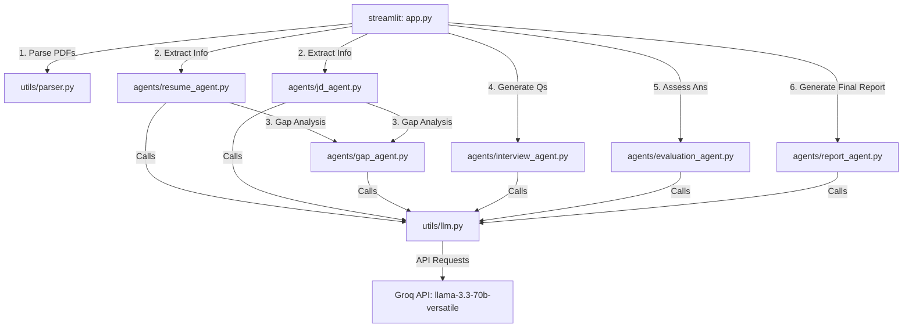

# AI Interview Preparation Assistant - Project Explanation

This document provides a comprehensive overview of the **AI Interview Preparation Assistant** codebase, explaining its architecture, components, features, agents, and dependencies.

---

## 🎯 Project Overview
The **AI Interview Preparation Assistant** is an agentic, multi-agent AI system designed to conduct interactive, level-specific technical interviews. It parses a candidate's resume and a target job description (JD), analyzes technical gaps, dynamically generates interview questions, assesses the candidate's answers in real time, and outputs a professional hiring report.

---

## 🏗️ Architecture & Component Flow

The project is structured with a clean separation of concerns, dividing the frontend interface, agent logic, and utilities:

---

## 📂 Codebase Structure & File Explanations

Here is a summary of all the files in the directory and their purposes:

### 1. Root Files
*   **[app.py](file:///d:/interview%20pro/final-capstone-project-agentic-ai-interview-preparation-assistant/app.py)**: The main entrypoint of the application. Built using Streamlit, it manages session state and coordinates the 3-stage user flow:
    1.  **Upload Stage**: Upload Resume (PDF), Job Description (PDF/text), and select the candidate's level (**Intern**, **Junior Developer**, or **Senior Developer**).
    2.  **Interview Stage**: Dynamic technical interview where the candidate answers 10 questions sequentially. Feedback is shown after each answer.
    3.  **Report Stage**: Displays a comprehensive final report with evaluation metrics, hiring verdict, and recommendations, and allows downloading the report.
*   **[requirements.txt](file:///d:/interview%20pro/final-capstone-project-agentic-ai-interview-preparation-assistant/requirements.txt)**: Python package dependencies.
*   **[.env](file:///d:/interview%20pro/final-capstone-project-agentic-ai-interview-preparation-assistant/.env)**: Environment configuration file containing the `GROQ_API_KEY`.

### 2. The Agentic Layer (`/agents`)
This folder contains specialized micro-agents that manage specific cognitive functions:
*   **[resume_agent.py](file:///d:/interview%20pro/final-capstone-project-agentic-ai-interview-preparation-assistant/agents/resume_agent.py)**: Extracts structured data (skills, projects, experience, education) from raw resume text into JSON format using the LLM.
*   **[jd_agent.py](file:///d:/interview%20pro/final-capstone-project-agentic-ai-interview-preparation-assistant/agents/jd_agent.py)**: Extracts key parameters (required skills, preferred skills, responsibilities, and experience requirements) from the job description.
*   **[gap_agent.py](file:///d:/interview%20pro/final-capstone-project-agentic-ai-interview-preparation-assistant/agents/gap_agent.py)**: Computes a candidate match percentage, highlights matched skills, and lists missing skills by comparing resume skills against JD requirements.
*   **[interview_agent.py](file:///d:/interview%20pro/final-capstone-project-agentic-ai-interview-preparation-assistant/agents/interview_agent.py)**: Acts as the conversational technical interviewer. Key features include:
    *   **Level Adaptation**: Adjusts topics and avoids complex ones depending on the selected level (**Intern** focus on projects/APIs, **Junior** focus on security/databases/code quality, **Senior** focus on scalability/microservices/architecture).
    *   **Performance Adaptation**: Reads the previous question's score. If high (>= 7), it asks deeper follow-up questions on the same topic; if low (< 4), it downgrades to a more basic, foundational question.
    *   **Natural Conversational Style**: Constrained by system prompts to speak like a human interviewer (short questions, no academic jargon).
*   **[evaluation_agent.py](file:///d:/interview%20pro/final-capstone-project-agentic-ai-interview-preparation-assistant/agents/evaluation_agent.py)**: Scores candidate answers on a scale from 0 to 10 across four criteria: *Accuracy*, *Clarity*, *Depth*, and *Communication*. It also calculates the overall score and yields constructive feedback.
*   **[report_agent.py](file:///d:/interview%20pro/final-capstone-project-agentic-ai-interview-preparation-assistant/agents/report_agent.py)**: Compiles all performance metrics, answers, and feedback to generate a professional candidate report. Evaluates performance against level-specific benchmarks and recommends a hiring decision: *Strong Hire*, *Hire*, *Borderline*, or *No Hire*.

### 3. Utility Helpers (`/utils`)
*   **[llm.py](file:///d:/interview%20pro/final-capstone-project-agentic-ai-interview-preparation-assistant/utils/llm.py)**: The central LLM interface. It loads environment variables, initializes the Groq client, configures standard parameters (like temperature), handles error management (API connection failures, rate limits), and targets the `llama-3.3-70b-versatile` model.
*   **[parser.py](file:///d:/interview%20pro/final-capstone-project-agentic-ai-interview-preparation-assistant/utils/parser.py)**: Handles text extraction from uploaded PDF documents using `pypdf`.

---

## 🛠️ Technology Stack & Libraries Used

The application is built using the following core tools and libraries:

| Technology | Purpose |
| :--- | :--- |
| **Python** | Primary development language. |
| **Streamlit** | Framework for developing interactive frontend dashboard web apps. |
| **Groq SDK (`groq`)** | Client SDK to interface with Groq's high-speed inference endpoints. |
| **Llama 3.3 70B (`llama-3.3-70b-versatile`)** | The foundational large language model powering the agents. |
| **pypdf** | Pure-python library to extract text and process PDF files. |
| **python-dotenv** | Loads key-value pairs from `.env` files into environment variables. |

---

## 💡 Key Design Patterns Implemented

1.  **State Management**: Extensive use of Streamlit's `st.session_state` allows carrying candidate documents, active questions, score histories, evaluations, and stage indicators throughout the app's lifecycle.
2.  **Robust JSON Extraction**: Prompting guidelines force the agents to output pure JSON data, which is cleaned of markdown code fences and safely loaded using `json.loads` with fail-safes.
3.  **Adaptive Loop Routing**: The Interview stage coordinates with the Interview and Evaluation agents dynamically. It uses the `last_score` state value to steer the difficulty of the next question.
4.  **Expectation Benchmarking**: Feedback and report outcomes are adjusted based on the level requested. An Intern is evaluated relative to basic framework understanding, while a Senior Developer is assessed on architectural trade-offs.
